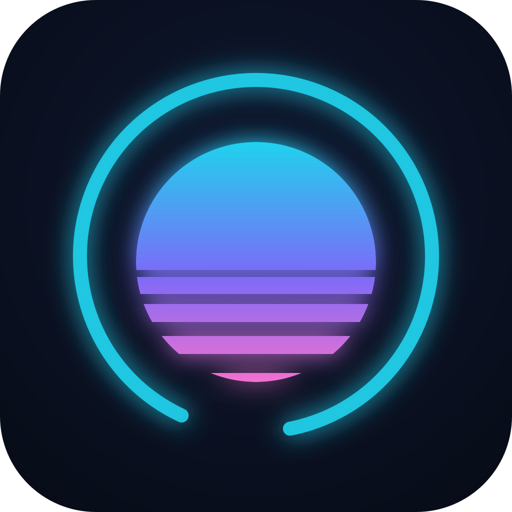

<div align="center">



# IAction

**A neon retro-futuristic desktop studio for AI-assisted work — where your Claude subscription, OpenRouter, and local Ollama models are equal citizens.**

[](LICENSE)
[](https://tauri.app)
[](https://react.dev)
[](https://nodejs.org)
[](#-privacy-by-architecture)

*Pilot AI agents across all your projects from one keyboard-friendly cockpit — locally, observably, and without vendor lock-in.*

🇫🇷 [Version française](README.fr.md)

<!-- screenshot: coming soon (demo-project captures) -->

</div>

---

## Why IAction?

Most AI chat apps make you choose: a polished cloud UI **or** local models; a great Claude experience **or** provider freedom. IAction refuses the choice:

- 🪷 **Your Claude subscription is a first-class engine** (via the Claude Agent SDK) — alongside OpenRouter, Ollama, and any OpenAI-compatible endpoint. Switch per conversation, or let the router decide.
- 📁 **Projects are real directories on your disk** — with a file tree, editable files, per-project knowledge, agents, and MCP servers. Not a chat log: a workspace.
- 🧭 **You stay in command**: every token spent is measured locally, every failure is journaled, every agent action can require your approval — or run fully autonomous when you say so.

All of it wrapped in an unapologetic **neon synthwave UI** — because a tool you live in should be a place you like.

## ✨ Features

### 🔌 Multi-provider by design
- **Claude (subscription)** through the official Agent SDK: streaming turns, tool use, background tasks, permission prompts, session resume.
- **Neutral engine** for everyone else: OpenRouter, Ollama, LM Studio, any OpenAI-compatible endpoint — same chat contract, same UI.
- Per-conversation engine & model selection, with curated favorites per provider.

### 🗂️ Projects bound to directories
- Each project points at a folder: browse the tree, open files in tabs, edit and save without leaving the app.
- **Multi-tab conversations** with true background streaming — start a long agent run, switch tabs or projects, come back to the result.
- Session history per project, auto-titled, message queueing, and mid-turn message injection (talk to an agent *while* it works).
- An app registry ("open with…") to launch your own tools on project files.

### 🤖 Agents & orchestration
- Declarative agents in YAML (`.iaction/agents/`): engine, model, permission mode, instructions, tool allowlist, max turns.
- **Visual orchestration**: chain steps across agents and engines, watch runs unfold live, re-run headlessly from the CLI.
- Permission modes from "validate every action" to fully autonomous — remembered per tool when you choose "don't ask again".

### 🧠 Smart, cost-aware routing
- **Auto mode** classifies each message by complexity (fast heuristics + an optional local LLM classifier — free, private) and routes it to the right tier: local model, mid-tier, or top-tier.
- **Overflow control**: when your subscription window saturates, IAction can spill to a paid API — under a monthly budget cap you set, with a visible banner every time it happens. No silent spend.
- Live gauges for your subscription windows (5-hour / weekly) and remaining API credit.

### 📚 Project knowledge & local RAG
- Drop Markdown docs in `.iaction/connaissances/` — they're injected into the first turn, or indexed for **RAG with local embeddings** (Ollama `nomic-embed-text`; your documents never leave the machine).
- Pin extra documents per project; agents can search project knowledge and chat history through built-in MCP tools.

### 🔧 MCP everywhere
- Per-project MCP servers via standard `.mcp.json` — give agents real capabilities: control a DAW, query a database, drive your own tooling.
- MCP tool calls are labeled in the transcript and counted per server, so you always know which integration did what.

### 🎙️ Voice, both ways
- Dictation into the composer, and **local text-to-speech** (Kokoro) for replies — including a hands-free voice conversation mode. No cloud speech APIs involved.

### ⏰ Scheduled autonomous tasks
- Package an orchestration as a **recurring task** (systemd timers): daily mailbox triage, weekly quality reviews, doc-site audits… delivered disarmed, with a "report-only" rehearsal mode before you arm anything.

### 📊 Local supervision & observability
- A **Supervision dashboard** computed entirely on your machine: conversations, turns, tokens by project, by model, by period — including the share used autonomously by orchestrations.
- A consolidated application journal (JSONL on disk), a log explorer, an error-aware System page, and a versioned ticket backlog. **No silent failures** is a design rule of the project.

### 🔐 Privacy by architecture
- Local-first: state, history, usage stats and journals live in your XDG directories. Nothing is phoned home — there is no telemetry to disable.
- API keys stored in the **OS keyring**, never in files. The Rust core keeps the sidecar sandbox-supervised.

### 🌆 A UI worth living in
- Neon "spacetime-curvature" theme, translucent surfaces, scanlines, keyboard-first navigation (Ctrl+1..6, Ctrl+Tab, command palette, focus zones), French-crafted with love.

> **Heads-up:** the UI and the design docs are currently **in French** (the author's native tongue). Internationalization is on the roadmap — contributions welcome!

## 🏗️ Architecture

```
React UI (ui/)  ⇄  Tauri IPC  ⇄  thin Rust core (src-tauri/)  ⇄  JSON-Lines over stdio  ⇄  Node sidecar (sidecar/)
```

- **ui/** — React + Vite front-end, neon theme as CSS tokens.
- **src-tauri/** — Tauri 2 shell: window, sidecar spawn & supervision, protocol relay, keyring, atomic state storage.
- **sidecar/** — Node process hosting the AI engines (Claude Agent SDK + neutral OpenAI-compatible engine), knowledge index, router, tasks, journal.
- The full UI⇄Rust⇄sidecar protocol is specified in [docs/protocol.md](docs/protocol.md) and covered by tests.

## 🚀 Quick start (Linux)

Prerequisites: Node ≥ 22, stable Rust, and Tauri's system dependencies:

```bash
sudo apt install libwebkit2gtk-4.1-dev libgtk-3-dev librsvg2-dev
```

```bash
git clone https://github.com/duvamduvam/iaction.git
cd iaction
npm install            # ui + sidecar workspaces
npm run sidecar:build  # compile the sidecar (required before the first run)
npm run dev            # tauri dev: compiles Rust, starts Vite + the window
```

Sidecar tests (no Tauri needed): `npm run sidecar:test`.

<details>
<summary><b>Known environment pitfalls (Linux)</b></summary>

- **VSCode installed via Snap**: injected variables (`GTK_PATH`, `GDK_PIXBUF_MODULE_FILE`…) crash the Tauri binary at startup. Use `./scripts/dev.sh`, which cleans the environment before `npm run dev`.
- **Repo inside a Nextcloud-synced folder**: the sync client watches `node_modules/` and `target/` and can exhaust inotify watchers. Raise the limit (`sudo sysctl fs.inotify.max_user_watches=1048576`) and/or exclude `node_modules`, `target`, `dist` from sync.

</details>

## 🧭 How it compares

| | IAction | LibreChat | Jan / Cherry Studio | opcode (Claudia) |
|---|---|---|---|---|
| Form factor | Desktop (Tauri) | Web, multi-user | Desktop | Desktop (Tauri) |
| Claude **subscription** as engine | ✅ first-class | — | — | ✅ (Claude-only) |
| Provider equality (cloud + local) | ✅ | ✅ | ✅ | — |
| Projects = real directories | ✅ | — | partial | ✅ |
| Complexity-based routing + budget caps | ✅ | — | — | — |
| Scheduled autonomous tasks | ✅ | — | — | — |
| Local usage analytics | ✅ | partial | partial | ✅ |

*(Honest table: those are all excellent projects — pick what fits your workflow.)*

## 🗺️ Status & roadmap

IAction is **pre-1.0 and actively developed** — the core loop (multi-provider chat, projects, agents, routing, voice, tasks, supervision) is functional and used daily by its author. The product plan lives in [docs/plan.md](docs/plan.md) (French), the backlog in [docs/tickets.md](docs/tickets.md), and each subsystem has a design study under [docs/](docs/).

Near-term: hardening, packaging/distribution, i18n, screenshots & demo project.

## 🤝 Contributing

Issues and PRs are welcome — bug reports, i18n, docs, UI polish. The protocol test suite (`npm run sidecar:test`) is the safety net; please keep it green.

## 📄 License

[MIT](LICENSE) © 2026 duvamduvam
