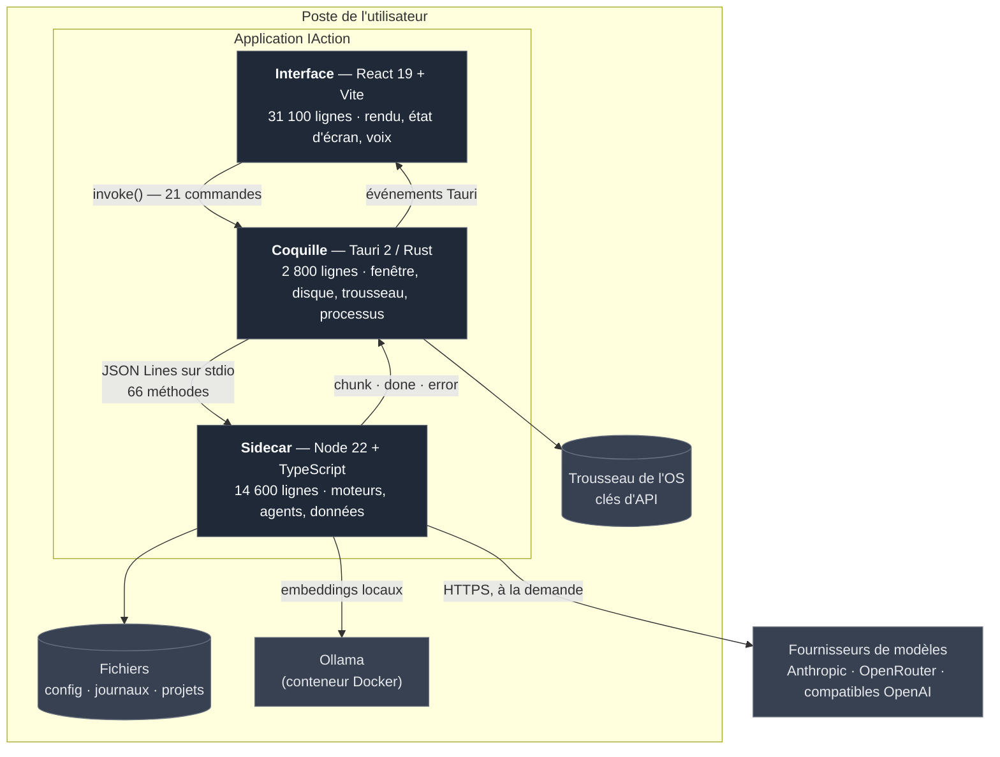
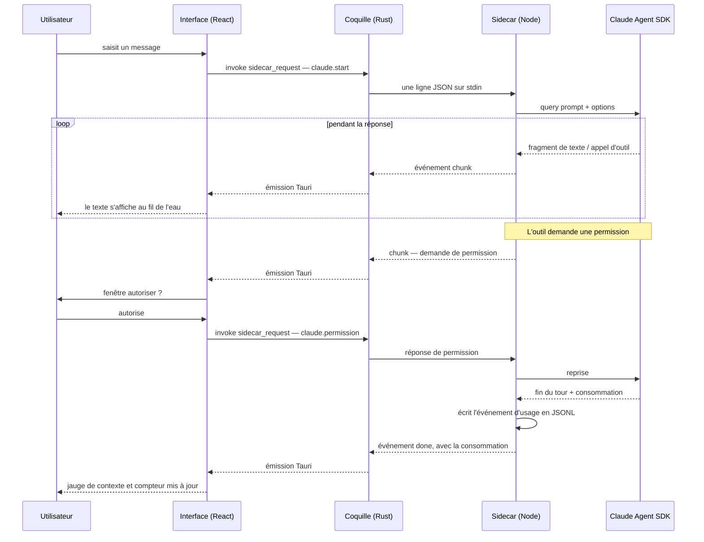
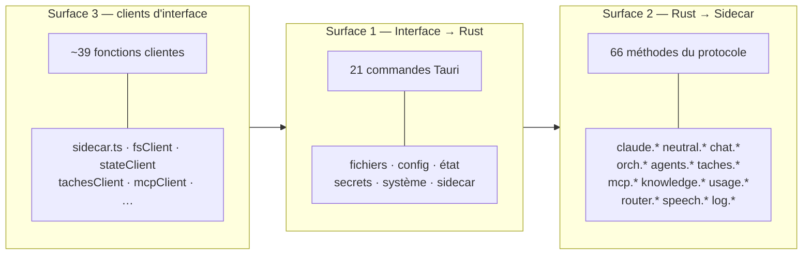
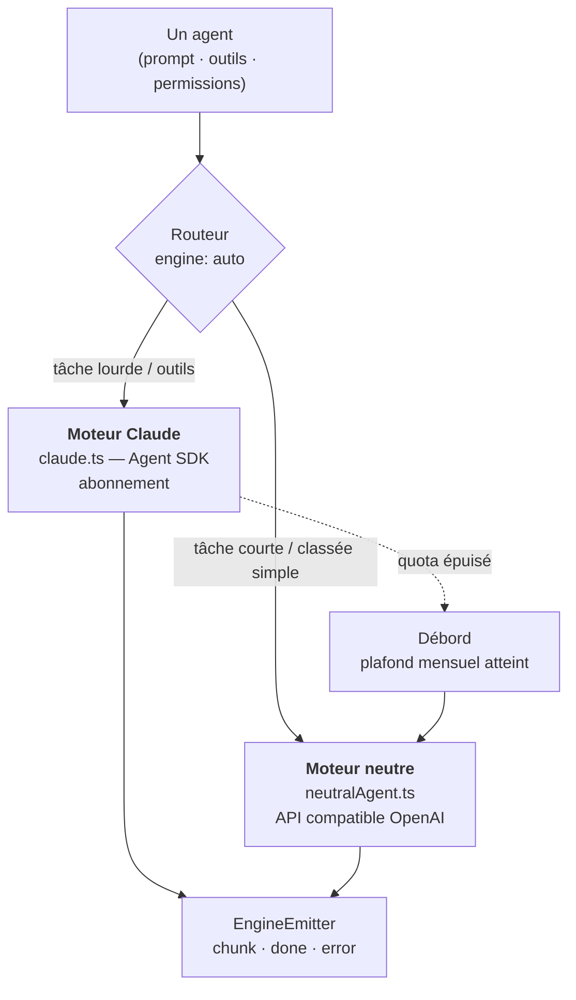
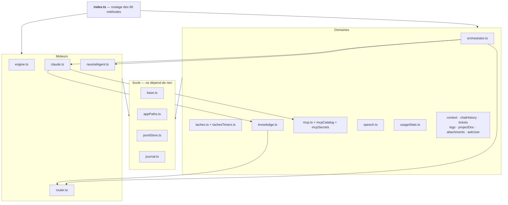
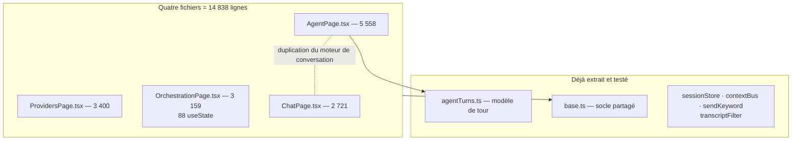
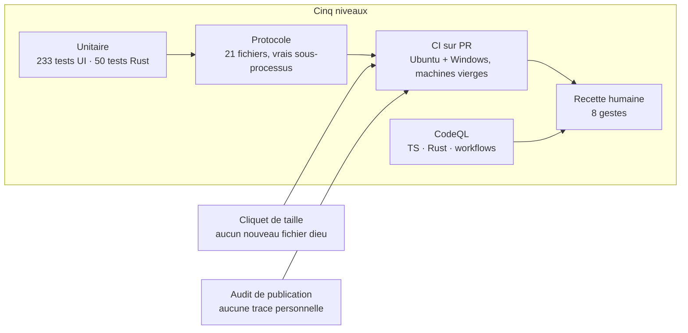

# Architecture d'IAction

*Relevé du 2026-08-08, mesuré sur le code — pas sur l'intention.*

Ce document décrit ce qui **est**, y compris ce qui est bancal. Les intentions
de refonte vivent dans [`etude-structure.md`](etude-structure.md), la stratégie
de vérification dans [`plan-de-test.md`](plan-de-test.md), et le contrat
d'échange détaillé dans [`protocol.md`](protocol.md).

---

## 1. Vue d'ensemble

IAction est une application de bureau locale. Aucun serveur n'est nécessaire :
tout tourne sur la machine de l'utilisateur, et les seules sorties réseau sont
celles que l'utilisateur demande explicitement (appels aux fournisseurs de
modèles, téléchargement de voix).



### Pourquoi trois couches et pas deux

Chaque couche existe parce qu'elle peut faire quelque chose que les autres ne
peuvent pas :

| Couche | Ce qu'elle seule peut faire | Ce qu'elle ne peut pas faire |
|---|---|---|
| **Interface** | Afficher, réagir à l'utilisateur, capter le micro | Toucher au disque, au réseau, aux secrets |
| **Coquille Rust** | Ouvrir une fenêtre native, lire le trousseau, lancer un processus, sortir du bac à sable du navigateur | Héberger le SDK Claude, qui est du JavaScript |
| **Sidecar Node** | Exécuter le SDK Claude, parler aux fournisseurs, tenir les agents | Afficher quoi que ce soit, accéder au trousseau |

Le sidecar n'est donc pas un choix de confort : le SDK Claude est un paquet
npm, et le faire tourner dans le moteur de rendu l'exposerait à la même
politique de sécurité que la page web. À l'inverse, le trousseau reste côté
Rust, hors de portée de tout code JavaScript.

---

## 2. Le chemin d'un tour de conversation

Le cas le plus courant — l'utilisateur envoie un message à un agent Claude qui
utilise un outil — traverse les trois couches deux fois.



Trois propriétés découlent de ce dessin :

- **Le flux est un vrai flux.** Aucun tampon n'attend la fin du tour ; chaque
  fragment traverse les trois couches. C'est ce qui rend l'application vivante,
  et ce qui rend la moindre fuite d'abonnement visible à l'écran.
- **L'identifiant de tour est la seule colle.** Tout événement porte l'`id` de
  la requête qui l'a déclenché. Des identifiants en collision produisaient un
  mélange de conversations : ils sont désormais des UUID, jamais un compteur.
- **La consommation est enregistrée par le sidecar, pas par l'interface.**
  Fermer la fenêtre en cours de tour ne perd pas la comptabilité.

---

## 3. Les trois surfaces de contact

C'est ici que se joue la cohérence de l'ensemble — et c'est aujourd'hui le
point faible connu.



**Le problème :** ces trois listes vivent dans trois fichiers indépendants que
rien ne confronte. Ajouter une méthode au sidecar sans son client, renommer une
commande sans son appelant, oublier une permission : rien ne le signale à la
compilation. L'écart n'apparaît qu'à l'exécution, chez l'utilisateur.

C'est l'objet de l'étape « registre unique des permissions » de l'étude de
structure, et des échantillons témoins du protocole.

### Le transport, en une ligne

```
UI  --invoke(sidecar_request, {method, params})-->  Rust
Rust --{"id","method","params"}\n--> stdin du sidecar
Rust <--{"event":"ready"|"chunk"|"done"|"error", "id", "data"}\n-- stdout du sidecar
```

`stdout` est réservé au protocole : une seule ligne non-JSON casse le flux, ce
que la suite de tests vérifie explicitement. Les traces vont sur `stderr` et
dans le journal.

---

## 4. Les moteurs : « tous agents à égalité »

Un agent ne sait pas quel moteur l'exécute. C'est le contrat `EngineEmitter`
(`chunk` / `done` / `error`) qui rend les moteurs interchangeables.



Le routeur décide en deux temps : une heuristique (`router.ts`, gratuite et
instantanée), et si elle hésite, un classificateur LLM court appelé à
température 0. Le débord d'abonnement bascule vers le moteur neutre quand le
plafond mensuel est atteint, plutôt que de laisser un tour échouer.

---

## 5. Où vivent les données

Rien n'est stocké en base. Tout est fichier, lisible et sauvegardable à la main
— c'est délibéré : un format qu'on peut ouvrir dans un éditeur est un format
qu'on ne perd pas.

| Emplacement | Contenu | Remarque |
|---|---|---|
| `<config>/net.duvam.iaction/` | `config.json`, journaux, usage, tickets | `~/.config` sous Linux, `%APPDATA%` sous Windows |
| `<config>/…/logs/*.jsonl` | journal consolidé, plus `coquille.jsonl` | la coquille écrit ses propres pannes, même sidecar mort |
| `<config>/…/usage/*.jsonl` | un événement par tour terminé | source des compteurs et du débord |
| `<données>/net.duvam.iaction/` | index RAG, voix téléchargées | volumineux, séparé de la config |
| `<projet>/.iadadou/` | agents, orchestrations, connaissances, tâches | **dans le projet**, versionnable avec lui |
| Trousseau de l'OS | clés d'API | service `iaction`, jamais un fichier |

Deux règles s'appliquent sans exception :

1. **Les clés d'API ne touchent jamais le disque.** Le trousseau est la seule
   voie ; `.env` est ignoré par git et seul `.env.example` est versionné.
2. **Rust et Node doivent calculer les mêmes chemins.** `appPaths.ts` reproduit
   exactement `app_data_dir()` / `app_config_dir()` de Tauri. Un désaccord
   entre les deux couches crée deux configurations parallèles, et l'utilisateur
   perd la sienne sans message d'erreur — c'est arrivé lors du renommage.

---

## 6. La carte du sidecar

Le sidecar est la couche la mieux structurée : 25 modules, un socle sans
dépendance, et un point d'entrée qui n'est que du routage.



Le graphe est acyclique et le socle est bien une feuille : `base.ts` n'importe
rien. `index.ts` dépend de 21 modules, ce qui est normal pour un routeur, mais
c'est aussi ce qui en fait le fichier à ne jamais laisser porter de logique.

---

## 7. L'interface : où le poids s'est accumulé

C'est l'inverse du sidecar, et le chantier en cours.



`AgentPage` et `ChatPage` font la même chose deux fois. Ce n'est pas une
observation esthétique : **le même défaut y a été corrigé deux fois** (la jauge
de contexte figée à zéro après compaction). Le moteur de conversation partagé
est pour cette raison l'étape la plus rentable du plan.

---

## 8. Ce qui est vérifié, et par quoi

Le déséquilibre est le fait le plus important de cette section, alors il vient
en premier :

| Couche | Code | Test | Rapport |
|---|---:|---:|---:|
| Interface | 31 102 | 623 | **1 pour 50** |
| Sidecar | 14 642 | 8 472 | 1 pour 1,7 |
| Coquille Rust | 2 821 | 50 `#[test]` inclus | — |

Ce n'est pas un manque de discipline : **on ne peut pas tester unitairement un
composant de 5 558 lignes**, il n'expose rien. Les tests ne suivent pas la
bonne volonté, ils suivent la structure. C'est pourquoi l'extraction et la
couverture sont le même chantier, et pourquoi promettre des tests d'interface
avant de découper serait promettre du vide.



| Niveau | Ce qu'il prouve | Ce qu'il ne prouve pas |
|---|---|---|
| Unitaire | La logique pure est juste | Que les couches se parlent |
| Protocole | Le contrat tient bout en bout, vrai sidecar lancé | Que l'écran affiche juste |
| CI sur PR | Ça compile et passe sur les deux systèmes, **sans rien du poste** | Que l'installeur s'installe |
| CodeQL | Que des formes dangereuses connues sont absentes | Qu'il n'y en a pas d'autres |
| Recette humaine | Que le produit fonctionne | Rien d'automatisable |

Le passage de la CI « sur poussée » à la CI « sur pull request » (2026-08-09)
n'est pas un détail de plomberie : c'est ce qui rend la machine vierge
OBLIGATOIRE avant que quoi que ce soit atteigne `main`. Le poste de
développement ment par omission — il connaît des fichiers que l'instantané
n'emporte pas (T-011) et ignore ce que Windows seul contredit (T-014).

Deux règles de fonctionnement :

- **Le code de sortie fait foi**, jamais le nombre de lignes « OK » affichées :
  une suite s'arrête au premier échec, donc un compteur qui baisse ressemble à
  un compteur qui va bien.
- **Tout défaut devient un test**, au niveau le plus bas qui l'aurait attrapé.

---

## 9. Fragilités connues

Listées ici parce qu'un schéma qui ne montre que ce qui va bien ne sert à rien.

| Fragilité | Conséquence | Traitement prévu |
|---|---|---|
| Quatre fichiers dieux dans l'interface | Non testables, donc non testés | Étapes 3 à 6 du plan |
| Trois listes de surface non confrontées | Un écart ne se voit qu'à l'exécution | Registre unique des permissions |
| Chemins recalculés dans deux langages | Deux configurations parallèles possibles | Échantillons témoins du protocole |
| `claude.ts` construit sur une fermeture | Difficile à couvrir unitairement | Étape 5 |
| Tests hors du périmètre d'eslint | Les tests eux-mêmes ne sont pas relus par l'outil | À élargir |
| Installeur Windows : désinstaller par défaut | Mise à jour en deux temps | Voir §9 du plan d'action |

---

## 10. Pour retrouver son chemin

| Question | Fichier |
|---|---|
| Que renvoie telle méthode ? | [`protocol.md`](protocol.md) |
| Pourquoi cette structure, et où elle va | [`etude-structure.md`](etude-structure.md) |
| Comment tester, et qui teste quoi | [`plan-de-test.md`](plan-de-test.md) |
| Comment sont fabriqués les installeurs | [`empaquetage.md`](empaquetage.md) |
| Où sont les chemins de fichiers | `sidecar/src/appPaths.ts` |
| Où est le routage des méthodes | `sidecar/src/index.ts` |
